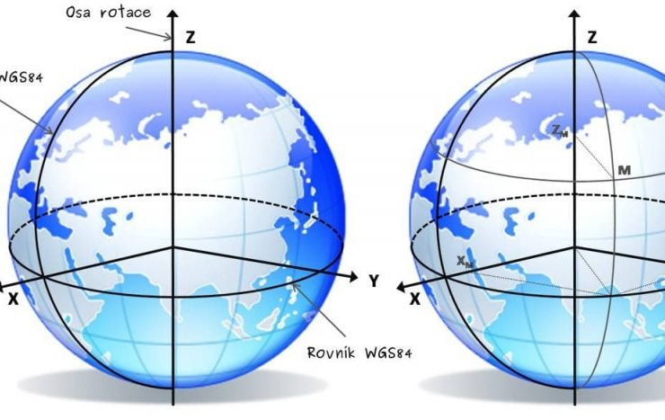

# *Hoja de Vida* de ***Saul Rojas***
Licenciatura en Topografia y Geodesia

Universidad Nacional de Costa Rica

Ingeniero en [Consejo Nacional de Vialidad](https://conavi.go.cr/)

## *Area de Interes*
***Topografia***
*Geodesia*
*Teledeteccion*

